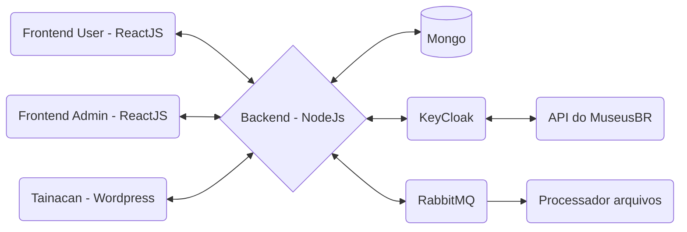

# Arquitetura do projeto INBCM

## Objetivos da arquitetura

A arquitetura do projeto INBCM foi concebida para ser modular, robusta e escalável, visando atender a uma ampla gama de requisitos e cenários de uso. Buscamos criar uma plataforma que possa evoluir e se adaptar às necessidades futuras, mantendo a integridade, segurança e acessibilidade dos dados.

## Componentes da arquitetura (Frontend)

### Um plugin de extensão do Tainacan

O plugin para extensão do Tainacan permitirá aos museus e instituições culturais integrarem suas coleções ao INBCM diretamente do painel de administração do Tainacan. Este plugin oferece uma interface intuitiva para o envio de inventários e consulta de dados, garantindo uma experiência de usuário uniforme e integrada.

### Aplicação Web INBCM

A aplicação web do INBCM serve como o ponto central para usuários que não utilizam o Tainacan. Aqui, os usuários podem baixar templates de inventário, preencher e submeter seus arquivos para análise e inclusão no sistema. Além disso, esta plataforma permite a consulta de itens museológicos já catalogados, oferecendo filtros e ferramentas de pesquisa avançadas.

### Aplicação Web de administração para funcionários do IBRAM

A aplicação web de administração serve como uma plataforma para que funcionários do IBRAM possam gerenciar e monitorar os processos e dados do sistema, incluindo a revisão e validação de informações enviadas pelos museus.

## Componentes da arquitetura (Backend)

### Node.js

A escolha do Node.js foi devido à sua eficiência com operações I/O assíncronas, sendo ideal para o backend que lidará com um volume significativo de requisições e processamento de dados em tempo real. O Node.js atua como a espinha dorsal da plataforma, gerenciando a lógica de aplicação, autenticação de usuários e interação com o banco de dados.

### Autenticação

A autenticação dos usuários será gerenciada pelo Keycloak, que se integra ao serviço MuseusBR para verificar credenciais. Este processo garante que apenas usuários autorizados possam enviar inventários e acessar dados sensíveis.

## Componentes da arquitetura (Funcionalidades Chave)

