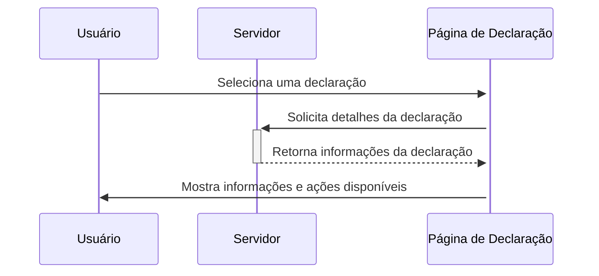

# Página de declarações

## Descrição geral
A página de declarações é acessada após um usuário escolher uma declaração específica para visualizar ou editar. Esta página permite visualizar detalhes completos da declaração, incluindo status, pendências e ações como download e retificação.

## Tecnologias e bibliotecas utilizadas

- **React**: Framework usado para construir a interface.
- **React Router**: Gerencia a navegação entre as páginas.
- **React Query**: Usado para buscar dados assincronamente.
- **Date-Fns**: Utilizado para formatar datas exibidas na página.
- **Tailwind CSS (clsx)**: Usado para condicionalmente juntar classes CSS.

## Componentes da página

### Estrutura básica

- **DefaultLayout**: O layout geral que inclui cabeçalho e outros elementos UI compartilhados.
- **MismatchsModal**: Um modal que é exibido para mostrar pendências específicas das declarações.

## Fluxo da página



## Ações disponíveis
- Download de recibos e planilhas.
- Visualização e retificação de pendências.
- Navegação entre diferentes seções de acervos: museológico, bibliográfico e arquivístico.

## Exemplos de código

### Suspense query para carregar dados
```javascript
const { data } = useSuspenseQuery({
  queryKey: ["declaracao", id],
  queryFn: async () => {
    const response = await request(`/api/declaracoes/${id}`);
    return response.json();
  }
});
```

### Interação com tabs de acervos
```javascript
const tabs = ["museologico", "bibliografico", "arquivistico"];
const currentTab = useState("museologico");

<div className="br-tab mt-10" data-counter="true">
  <nav className="tab-nav">
    <ul>
      {tabs.map(tab => (
        <li className={clsx("tab-item", currentTab === tab && "is-active")}
            onClick={() => setCurrentTab(tab)}>
          <button>{`Acervo ${tab}`}</button>
        </li>
      ))}
    </ul>
  </nav>
  <div className="tab-content">
    {tabs.map(tab => (
      <div className={clsx("tab-panel", currentTab === tab && "active")}>
        <TableItens acervo={tab} ano={data.anoDeclaracao} museuId={data.museu_id._id} />
      </div>
    ))}
  </div>
</div>
```

## Considerações finais
Esta página é fundamental para a gestão das declarações dentro do sistema INBCM, permitindo aos usuários um controle detalhado sobre cada declaração e suas dependências. A documentação deve ser mantida atualizada para refletir quaisquer mudanças no fluxo de usuário ou nos componentes usados.