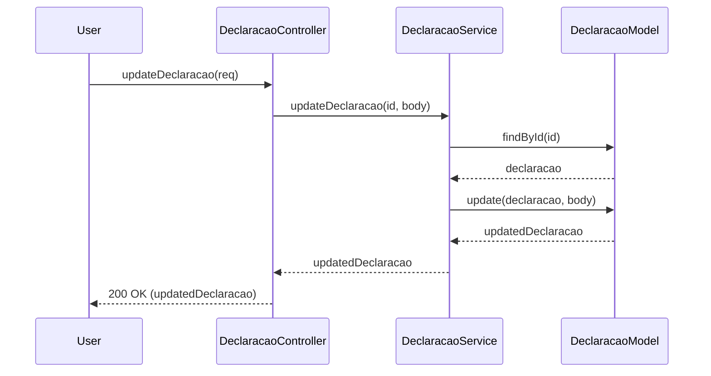

# Envio de declarações, envio de retificações e download de recibos

## Introdução
Esta documentação detalha as funcionalidades de envio de declarações, envio de retificações e download de recibos na aplicação. Inclui as descrições das classes e métodos utilizados, bem como diagramas de sequência para melhor entendimento dos processos.

## Envio de declarações
* **Classe**: DeclaracaoController
* **Método**: uploadDeclaracao

Este método recebe uma solicitação para enviar uma nova declaração, cria a declaração e um recibo associado, e retorna uma resposta de sucesso ao usuário.

```typescript
import { Request, Response } from "express";
import { Declaracoes, DeclaracaoModel } from "../models";
import DeclaracaoService from "../service/DeclaracaoService";

class DeclaracaoController {
  private declaracaoService: DeclaracaoService;

  constructor() {
    this.declaracaoService = new DeclaracaoService();
    this.uploadDeclaracao = this.uploadDeclaracao.bind(this);
    // outros métodos...
  }

  async uploadDeclaracao(req: Request, res: Response) {
    try {
      const declaracao = await this.declaracaoService.uploadDeclaracao(req);
      res.status(201).json(declaracao);
    } catch (error) {
      console.error("Erro ao fazer upload da declaração:", error);
      res.status(500).json({ message: "Erro ao fazer upload da declaração" });
    }
  }
}

export default new DeclaracaoController();
```

## Diagrama de sequência: envio de declaração


## Envio de retificações

* **Classe**: DeclaracaoController
* **Método**: updateDeclaracao

Este método recebe uma solicitação para retificar uma declaração existente, atualiza a declaração e retorna uma resposta de sucesso ao usuário.

```typescript
import { Request, Response } from "express";
import { Declaracoes } from "../models";
import DeclaracaoService from "../service/DeclaracaoService";

class DeclaracaoController {
  private declaracaoService: DeclaracaoService;

  constructor() {
    this.declaracaoService = new DeclaracaoService();
    this.updateDeclaracao = this.updateDeclaracao.bind(this);
    // outros métodos...
  }

  async updateDeclaracao(req: Request, res: Response) {
    try {
      const { id } = req.params;
      const updatedDeclaracao = await this.declaracaoService.updateDeclaracao(id, req.body);
      res.status(200).json(updatedDeclaracao);
    } catch (error) {
      console.error("Erro ao atualizar declaração:", error);
      res.status(500).json({ message: "Erro ao atualizar declaração" });
    }
  }
}

export default new DeclaracaoController();
```

## Diagrama de sequência: envio de retificação



## Download de Recibos
* **Classe**: ReciboController
* **Método**: gerarRecibo

Este método recebe uma solicitação para baixar um recibo específico, verifica a existência do recibo, gera o PDF do recibo se necessário, e retorna o recibo ao usuário.

```typescript
import { Request, Response } from "express";
import mongoose from "mongoose";
import { gerarPDFRecibo } from "../service/ReciboService";

class ReciboController {
  async gerarRecibo(req: Request, res: Response) {
    try {
      const { idDeclaracao } = req.params;
      if (!mongoose.Types.ObjectId.isValid(idDeclaracao)) {
        res.status(400).json({ error: "ID inválido." });
        return;
      }

      const declaracaoId = new mongoose.Types.ObjectId(idDeclaracao);
      const pdfBuffer = await gerarPDFRecibo(declaracaoId);

      res.setHeader("Content-Disposition", "attachment; filename=recibo.pdf");
      res.setHeader("Content-Type", "application/pdf");
      res.send(pdfBuffer);
    } catch (error) {
      console.error("Erro ao gerar o recibo:", error);
      res.status(500).json({ error: "Erro ao gerar o recibo." });
    }
  }
}

export default ReciboController;
```

## Diagrama de sequência: download de recibo


## Conclusão
Esta documentação fornece uma visão detalhada das funcionalidades de envio de declarações, envio de retificações e download de recibos, incluindo as descrições das classes e métodos utilizados, bem como diagramas de sequência para melhor compreensão dos processos. Essas funcionalidades são cruciais para garantir a integridade e a conformidade das declarações e a acessibilidade dos recibos para os usuários. ​