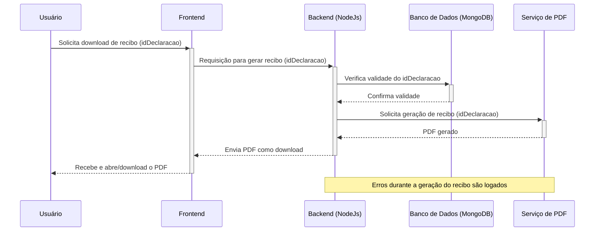

# Envio de declarações, envio de retificações e download de recibos

## Introdução
Esta página detalha as funcionalidades de envio de declarações, envio de retificações e download de recibos na aplicação. Inclui as descrições das classes e métodos utilizados, bem como diagramas de sequência para melhor entendimento dos processos.

## Envio e retificação de declarações

Este método recebe uma solicitação de envio de nova declaração, cria a declaração e um recibo associado, e retorna uma resposta de sucesso ao usuário.

```typescript
 /**
 * Cria uma nova declaração ou retifica uma declaração existente, associando-a a um museu e ao responsável.
 * 
 * @param {string} req.params.anoDeclaracao - O ano da declaração, fornecido na URL.
 * @param {string} req.params.museu - O ID do museu associado à declaração, fornecido na URL.
 * @param {string} req.params.idDeclaracao - O ID da declaração existente que está sendo retificada, se aplicável.
 * 
 * @returns {Promise<Response>} - Retorna uma resposta HTTP que contém o status da operação e a declaração criada ou um erro.
 * 
 * @throws {400} - Se dados obrigatórios estão ausentes ou o museu não é válido.
 * @throws {404} - Se a declaração a ser retificada não for encontrada.
 * @throws {500} - Se ocorrer um erro interno ao processar a declaração.
 */
  async criarDeclaracao(req: Request, res: Response) {
    try {
        const { anoDeclaracao, museu: museu_id, idDeclaracao } = req.params;
        const user_id = req.user.id;
        
        if (!museu_id || !user_id) {
            return res.status(400).json({ success: false, message: "Dados obrigatórios ausentes" });
        }
   
        const museu = await Museu.findOne({ _id: museu_id, usuario: user_id });
        if (!museu) {
            return res.status(400).json({ success: false, message: "Museu inválido" });
        }

        const files = req.files as { [fieldname: string]: Express.Multer.File[] };
        const salt = generateSalt();

        // Busca declaração existente, se idDeclaracao for fornecido
        const declaracaoExistente = idDeclaracao
            ? await Declaracoes.findOne({
                _id: idDeclaracao,
                responsavelEnvio: user_id,
                anoDeclaracao,
                museu_id: museu_id,
            }).exec()
            : await this.declaracaoService.verificarDeclaracaoExistente(museu_id, anoDeclaracao);

        if (idDeclaracao && !declaracaoExistente) {
            return res.status(404).json({ message: "Não foi encontrada uma declaração anterior para retificar." });
        }
       
        const ultimaDeclaracao = await Declaracoes.findOne({ museu_id, anoDeclaracao }).sort({ versao: -1 }).exec();
        const novaVersao = (ultimaDeclaracao?.versao || 0) + 1;

        // Cria os dados da nova declaração
        const novaDeclaracaoData = await this.declaracaoService.criarDadosDeclaracao(
            museu,
            user_id as unknown as mongoose.Types.ObjectId, 
            anoDeclaracao,
            declaracaoExistente,
            novaVersao,
            salt
        );

        const novaDeclaracao = new Declaracoes(novaDeclaracaoData);

        // Atualiza os arquivos associados à nova declaração
        await this.declaracaoService.updateDeclaracao(files["arquivistico"], novaDeclaracao, "arquivistico", declaracaoExistente?.arquivistico || null, novaVersao);
        await this.declaracaoService.updateDeclaracao(files["bibliografico"], novaDeclaracao, "bibliografico", declaracaoExistente?.bibliografico || null, novaVersao);
        await this.declaracaoService.updateDeclaracao(files["museologico"], novaDeclaracao, "museologico", declaracaoExistente?.museologico || null, novaVersao);

        // Marca a nova declaração como a última
        novaDeclaracao.ultimaDeclaracao = true;
        await novaDeclaracao.save();

        // Atualiza declarações anteriores para não serem mais a última
        await Declaracoes.updateMany(
          {
            museu_id,
            anoDeclaracao,
            _id: { $ne: novaDeclaracao._id },
          },
          { ultimaDeclaracao: false }
        );

        return res.status(200).json(novaDeclaracao);
    } catch (error) {
        console.error("Erro ao enviar uma declaração:", error);
        return res.status(500).json({ message: "Erro ao enviar uma declaração: ", error });
    }
}

```

#### Descrição
O método `criarDeclaracao` é responsável por criar ou retificar uma declaração para um museu específico, associado ao usuário autenticado. Ele verifica a existência de declarações anteriores, lida com o upload de arquivos e mantém o controle de versões das declarações.

#### Parâmetros
- `req: Request`: O objeto de requisição do Express, que contém:
  - `req.params`: Deve incluir `anoDeclaracao`, `museu` (como `museu_id`) e opcionalmente `idDeclaracao` se for uma retificação.
  - `req.user.id`: ID do usuário autenticado, utilizado para validar a propriedade do museu.
  - `req.files`: Arquivos enviados na requisição, categorizados por tipo (arquivístico, bibliográfico, museológico).
- `res: Response`: O objeto de resposta do Express utilizado para enviar de volta o resultado da operação.

#### Fluxo de execução
1. **Validação inicial**: Confirma se todos os dados necessários estão presentes e se o museu está associado ao usuário.
2. **Busca de declaração existente**: Verifica se há uma declaração anterior que corresponde aos critérios fornecidos.
3. **Geração de nova versão**: Calcula a versão da nova declaração com base na última versão disponível.
4. **Criação de dados da declaração**: Utiliza `declaracaoService.criarDadosDeclaracao` para compilar dados da nova declaração.
5. **Atualização de arquivos**: Atualiza ou adiciona arquivos associados à declaração.
6. **Finalização da declaração**: Marca a nova declaração como a última e atualiza as declarações anteriores para refletir isso.

#### Respostas
- **200 OK**: Retorna a declaração criada ou atualizada.
- **400 Bad request**: Retorna um erro se dados obrigatórios estiverem ausentes ou o museu for inválido.
- **404 Not found**: Retorna um erro se não for encontrada uma declaração anterior para retificar.
- **500 Internal server error**: Retorna um erro se ocorrer um problema ao processar a requisição.

#### Considerações de segurança
- Assegura que apenas o usuário com direitos sobre o museu possa criar ou alterar declarações.
- Todos os uploads de arquivos devem ser sanitizados e validados para evitar a execução de arquivos maliciosos.

#### Exemplos de uso
Um exemplo de uso desse método pode ser ilustrado em uma situação onde um usuário precisa atualizar os registros de seu museu para o ano corrente, enviando novos documentos arquivísticos, bibliográficos e museológicos.

#### Registro de erros
Todos os erros são logados com detalhes suficientes para diagnóstico, incluindo o tipo de erro e o estado da execução no momento do erro.

### Diagrama de sequência: envio de declaração


## Download de recibos

O método `gerarRecibo` é responsável por gerar um recibo em formato PDF para uma declaração específica, identificada pelo ID da declaração fornecido na requisição. Este método é crucial para fornecer um comprovante documental das declarações enviadas, auxiliando na gestão de documentação e na transparência das operações relacionadas às declarações museológicas.

```typescript
/**
   * Gera o recibo em formato PDF com base no ID da declaração fornecido na requisição.
   *   @param req.params - Parâmetros da rota:
   *     @param idDeclaracao - ID da declaração para a qual o recibo será gerado.

   */
  async gerarRecibo(req: Request, res: Response) {
    try {
      const { idDeclaracao } = req.params
      if (!mongoose.Types.ObjectId.isValid(idDeclaracao)) {
        res.status(400).json({ error: "ID inválido." })
        return
      }

      const declaracaoId = new mongoose.Types.ObjectId(idDeclaracao)
      const pdfBuffer = await gerarPDFRecibo(declaracaoId)

      res.setHeader("Content-Disposition", "attachment; filename=recibo.pdf")
      res.setHeader("Content-Type", "application/pdf")
      res.send(pdfBuffer)
    } catch (error) {
      console.error("Erro ao gerar o recibo:", error)
      res.status(500).json({ error: "Erro ao gerar o recibo." })
    }
  }
```

#### Parâmetros de entrada

- `req.params.idDeclaracao`: ID da declaração para qual o recibo será gerado. Este ID deve ser um identificador válido no formato do MongoDB, garantindo que a referência à declaração seja legítima e possa ser localizada no banco de dados.

#### Processo
- **Validação do ID**: Inicialmente, o método verifica se o idDeclaracao fornecido é um ID válido de MongoDB. Se não for válido, uma resposta com status 400 é retornada, indicando "ID inválido."
- **Geração do PDF**: Utiliza a função gerarPDFRecibo, passando o ID da declaração como argumento, para gerar o recibo em formato PDF.
- **Envio do recibo**: Configura os headers de resposta para indicar que o conteúdo é um arquivo PDF e fornece o PDF gerado como download ao usuário.

#### Respostas
- **200 OK**: O recibo em PDF é retornado como um arquivo para download.
- **400 Bad Request**: Retornado se o ID fornecido não for válido.
- **500 Internal Server Error**: Retornado se ocorrer um erro durante o processo de geração do recibo.

#### Considerações de segurança
A validação rigorosa do ID da declaração ajuda a prevenir ataques de injeção e garante que apenas recibos para declarações legítimas sejam gerados.

### Diagrama de sequência: download de recibo



## Conclusão
Esta documentação fornece uma visão detalhada das funcionalidades de envio de declarações, envio de retificações e download de recibos, incluindo as descrições das classes e métodos utilizados, bem como diagramas de sequência para melhor compreensão dos processos. Essas funcionalidades são cruciais para garantir a integridade e a conformidade das declarações e a acessibilidade dos recibos para os usuários.
