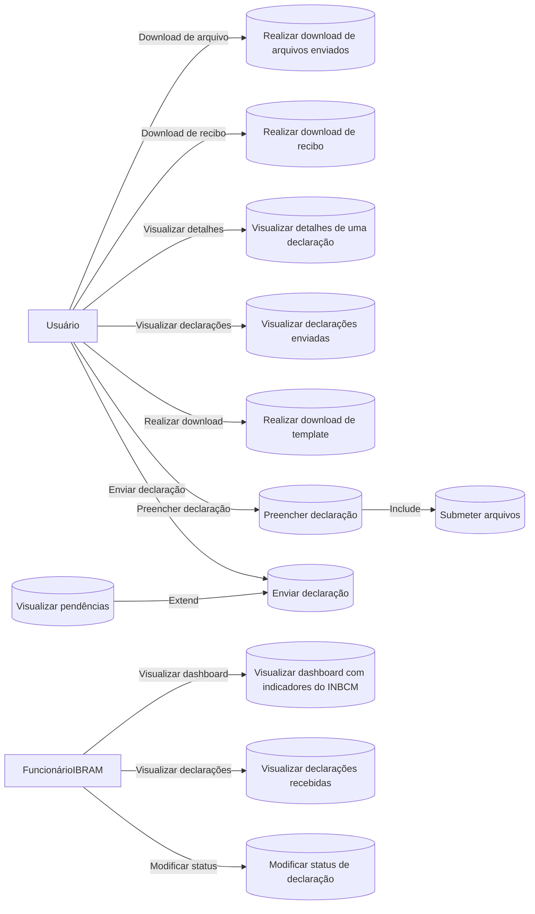
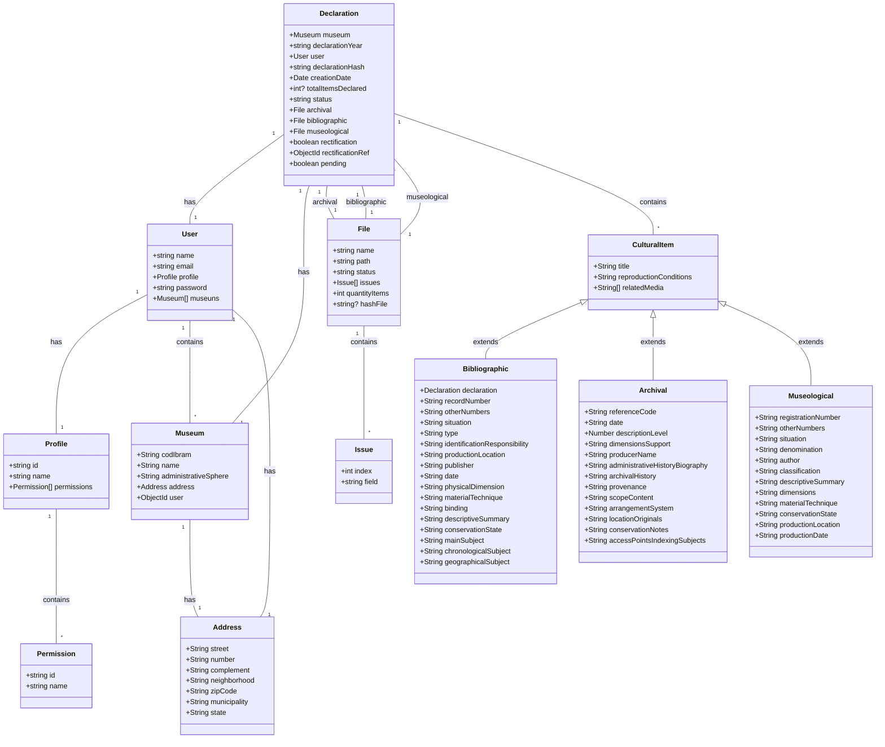

# Documentação do Projeto INBCM

## Visão geral

O Instituto Brasileiro de Museus (IBRAM), criado pela Lei 11.906/2009, lidera a Política Nacional de Museus (PNM) e busca não apenas gerenciar, mas também melhorar os serviços museológicos no Brasil. Isso envolve políticas para adquirir e preservar acervos e promover a integração entre museus. Uma função chave do IBRAM é administrar o Inventário Nacional de Bens Culturais Musealizados (INBCM), essencial para catalogar e preservar bens museológicos, bibliográficos e arquivísticos, conforme o Decreto no 8.124 de 2013. Com a necessidade de registros detalhados de todos os museus, surge a demanda por um sistema eficaz que apoie a manutenção atualizada dos dados musealizados. Para isso, está sendo desenvolvido um sistema de automação informacional pelo Laboratório de Redes e Sistemas Computacionais (NOCS Lab), vinculado ao Núcleo de Inovação em Tecnologias Computacionais (NITEC) do IFRN Campus Parnamirim. Esta colaboração entre o IBRAM e o IFRN, por meio do NOCS Lab, visa aprimorar a gestão cultural através da tecnologia avançada e processos otimizados, contribuindo significativamente para a preservação do patrimônio cultural brasileiro.

## Conceitos envolvidos

### Itens museológicos

Referem-se aos objetos que são coletados e preservados pelos museus devido ao seu valor histórico, artístico, científico ou cultural. Estes podem incluir artefatos, obras de arte, documentos históricos, e mais.

### Bens bibliográficos

São itens que pertencem às coleções de bibliotecas, incluindo livros, periódicos, manuscritos, e outros materiais impressos ou digitais que são conservados por seu conteúdo informativo e cultural.

### Bens arquivísticos

Refere-se a documentos ou informações acumulados, resultantes de atividades governamentais, institucionais, corporativas ou pessoais, que são preservados devido ao seu valor permanente, como evidência ou informação.

### Lei 11.906/2009

É a lei que estabeleceu o Instituto Brasileiro de Museus (IBRAM) e delineou suas responsabilidades na gestão e implementação da Política Nacional de Museus (PNM). Esta legislação serve como base legal para a organização e operação dos museus no Brasil.

### Decreto no 8.124 de 2013

Este decreto regulamenta a Lei 11.906/2009, estabelecendo diretrizes específicas para a preservação, a catalogação e a gestão dos bens culturais musealizados. Define também os procedimentos e responsabilidades para a manutenção do Inventário Nacional de Bens Culturais Musealizados (INBCM).

### Inventário Nacional de Bens Culturais Musealizados (INBCM)

É um registro centralizado que visa documentar, catalogar e garantir a preservação dos bens culturais que fazem parte dos museus brasileiros. Este instrumento é essencial para a gestão efetiva dos acervos museológicos, bibliográficos e arquivísticos em todo o país.

### Registro de museus

É o processo pelo qual os museus se qualificam e são reconhecidos oficialmente pelo governo. Isso implica em uma série de responsabilidades, incluindo a obrigação de fornecer informações detalhadas sobre seus acervos ao IBRAM.

### Preservação digital e física

Envolve estratégias e tecnologias aplicadas para garantir a integridade e acessibilidade de longo prazo dos bens culturais, tanto em formatos físicos quanto digitais.

### Automação informacional

Refere-se ao uso de tecnologias da informação e comunicação para automatizar a gestão de dados e informações, especialmente útil em contextos onde grandes volumes de dados, como em museus, precisam ser gerenciados de forma eficiente e precisa.

### Interoperabilidade de dados

A capacidade de diferentes sistemas e organizações trabalharem juntos, compartilhando dados e informações de maneira eficaz, o que é crucial para a integração dos dados dos museus em uma plataforma comum.

## Diagrama de Caso de Uso

O diagrama de caso de uso apresentado detalha as funções acessíveis para dois atores principais, "Usuário" e "Funcionário IBRAM". Para o "Usuário", as funcionalidades incluem gerenciamento completo de declarações, desde o preenchimento e envio até a visualização de detalhes e o download de recibos. Para o "Funcionário IBRAM", as funcionalidades focam na administração das declarações recebidas, visualização de indicadores de desempenho no dashboard e a habilidade de alterar o status das declarações. Este diagrama serve como uma ferramenta essencial para entender as interações entre usuários e sistema, facilitando o desenvolvimento e a operacionalização da plataforma.

## Explicação do diagrama de classes

O diagrama de classes descrito abaixo tem como objetivo fornecer uma visão clara e estruturada da arquitetura das entidades do sistema. Ele detalha as principais entidades envolvidas e suas inter-relações, facilitando a compreensão dos mecanismos de dados e funcionalidades do sistema. Este diagrama é essencial tanto para novos desenvolvedores quanto para stakeholders, ajudando-os a visualizar a organização dos componentes e como eles interagem para suportar as operações do sistema.

### Classes principais

### Entidades e relacionamentos

#### User
- **Descrição**: Representa os usuários do sistema.
- **Atributos**:
  - `name`: Nome do usuário.
  - `email`: E-mail do usuário.
  - `profile`: Perfil associado ao usuário.
  - `password`: Senha para autenticação do usuário.
  - `museums`: Lista de museus geridos pelo usuário.
- **Relacionamentos**:
  - Cada `User` possui um `Profile` e pode gerenciar múltiplos `Museum`.
  - Cada `User` também está associado a um `Address`.

#### Profile
- **Descrição**: Armazena informações sobre perfis que definem as permissões dos usuários.
- **Atributos**:
  - `name`: Nome do perfil.
  - `permissions`: Permissões atribuídas ao perfil.
- **Relacionamentos**:
  - Cada `Profile` contém várias `Permission`.

#### Permission
- **Descrição**: Define controles de acesso dentro do sistema.
- **Atributos**:
  - `name`: Nome descritivo da permissão.

#### Museum
- **Descrição**: Representa um museu dentro do sistema.
- **Atributos**:
  - `codIbram`: Código de identificação no IBRAM.
  - `name`: Nome do museu.
  - `administrativeSphere`: Esfera administrativa do museu.
  - `address`: Endereço físico do museu.
- **Relacionamentos**:
  - Cada `Museum` possui um `Address`.
  - Cada `User` pode gerenciar múltiplos `Museum`.

#### Address
- **Descrição**: Detalhes do endereço físico.
- **Atributos**:
  - `street`: Rua.
  - `number`: Número.
  - `complement`: Complemento.
  - `neighborhood`: Bairro.
  - `zipCode`: CEP.
  - `municipality`: Município.
  - `state`: Estado.
- **Relacionamentos**:
  - Usado por `Museum` e `User` para detalhar localizações.

#### Declaration
- **Descrição**: Representa uma declaração formal relacionada a um museu.
- **Atributos**:
  - `museum`: Museu relacionado à declaração.
  - `declarationYear`: Ano da declaração.
  - `user`: Usuário que fez a declaração.
  - `declarationHash`: Hash da declaração.
  - `creationDate`: Data de criação da declaração.
  - `totalItemsDeclared`: Total de itens declarados.
  - `status`: Status da declaração.
  - `archival`: Arquivo arquivístico associado.
  - `bibliographic`: Arquivo bibliográfico associado.
  - `museological`: Arquivo museológico associado.
  - `rectification`: Indica se é uma retificação.
  - `rectificationRef`: Referência à declaração original, se for uma retificação.
  - `pending`: Indica se está pendente.
- **Relacionamentos**:
  - Cada `Declaration` está vinculada a um `User` e um `Museum` e contém arquivos específicos.

#### File
- **Descrição**: Gerencia informações sobre arquivos específicos associados a declarações.
- **Atributos**:
  - `name`: Nome do arquivo.
  - `path`: Caminho de armazenamento do arquivo.
  - `status`: Status atual do arquivo.
  - `issues`: Problemas ou tarefas associadas ao arquivo.
  - `quantityItems`: Quantidade de itens no arquivo.
  - `hashFile`: Hash criptográfico opcional do arquivo para verificação.
- **Relacionamentos**:
  - Cada `File` pode conter várias `Issue`.

#### Issue
- **Descrição**: Representa questões específicas ou tarefas relacionadas a um arquivo.
- **Atributos**:
  - `index`: Índice da questão.
  - `field`: Campo relacionado à questão no arquivo.

#### CulturalItem
- **Descrição**: Classe base para diferentes tipos de itens culturais, que podem incluir detalhes bibliográficos, arquivísticos e museológicos.
- **Atributos**:
  - `title`: Título do item cultural.
  - `reproductionConditions`: Condições de reprodução do item.
  - `relatedMedia`: Mídia relacionada ao item.
- **Relacionamentos**:
  - `CulturalItem` é estendido pelas classes `Bibliographic`, `Archival` e `Museological`.

#### Bibliographic, Archival, Museological
- **Descrição**: Extensões especializadas de `CulturalItem` adaptadas às necessidades específicas de documentos bibliográficos, arquivísticos ou museológicos.
- **Atributos** e **Relacionamentos**:
  - Cada classe inclui atributos detalhados específicos para cada tipo e estende a classe base `CulturalItem`.

### Considerações Finais

Este documento serve como um guia essencial para o entendimento e a implementação do projeto INBCM, que envolve uma colaboração significativa entre o IBRAM e o NOCS Lab do IFRN. O objetivo principal é melhorar a gestão dos bens culturais musealizados através de uma plataforma de automação informacional, promovendo uma gestão mais eficaz e a preservação do patrimônio cultural brasileiro.

Através deste projeto, busca-se não apenas preservar, mas também facilitar o acesso e a interoperabilidade dos dados culturais, beneficiando museus e instituições culturais com uma integração mais eficiente. A modernização do Inventário Nacional de Bens Culturais Musealizados através deste sistema digital é um passo crucial para a sustentabilidade e a acessibilidade do patrimônio cultural nacional.

É recomendável que o documento seja revisado e atualizado periodicamente para refletir o progresso e as adaptações do projeto, garantindo que ele continue alinhado com as necessidades culturais e tecnológicas atuais. Este esforço contínuo assegurará a proteção e valorização do patrimônio cultural brasileiro para as futuras gerações.