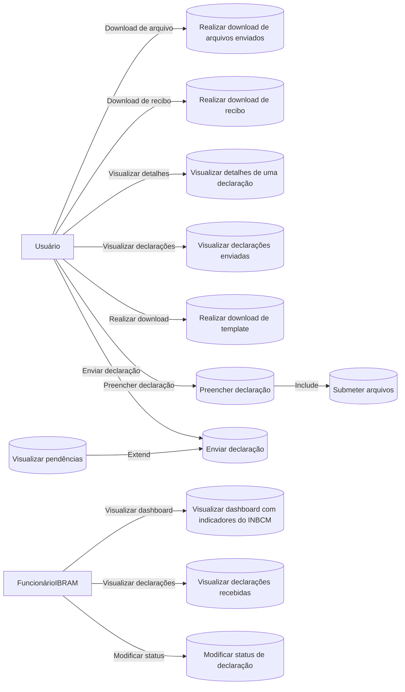
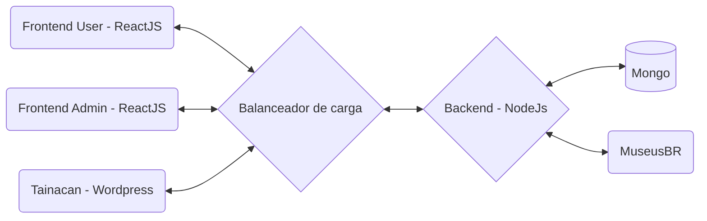

# Documentação do projeto

## Visão geral

O Instituto Brasileiro de Museus (IBRAM), criado pela Lei 11.906/2009, lidera a Política Nacional de Museus (PNM) e busca não apenas gerenciar, mas também melhorar os serviços museológicos no Brasil. Isso envolve políticas para adquirir e preservar acervos e promover a integração entre museus. Uma função chave do IBRAM é administrar o Inventário Nacional de Bens Culturais Musealizados (INBCM), essencial para catalogar e preservar bens museológicos, bibliográficos e arquivísticos, conforme o Decreto no 8.124 de 2013. Com a necessidade de registros detalhados de todos os museus, surge a demanda por um sistema eficaz que apoie a manutenção atualizada dos dados musealizados. Para isso, está sendo desenvolvido um sistema de automação informacional pelo Laboratório de Redes e Sistemas Computacionais (NOCS Lab), vinculado ao Núcleo de Inovação em Tecnologias Computacionais (NITEC) do IFRN Campus Parnamirim. Esta colaboração entre o IBRAM e o IFRN, por meio do NOCS Lab, visa aprimorar a gestão cultural através da tecnologia avançada e processos otimizados, contribuindo significativamente para a preservação do patrimônio cultural brasileiro.

## Conceitos envolvidos

### Itens museológicos

Referem-se aos objetos que são coletados e preservados pelos museus devido ao seu valor histórico, artístico, científico ou cultural. Estes podem incluir artefatos, obras de arte, documentos históricos, e mais.

### Bens bibliográficos

São itens que pertencem às coleções de bibliotecas, incluindo livros, periódicos, manuscritos, e outros materiais impressos ou digitais que são conservados por seu conteúdo informativo e cultural.

### Bens arquivísticos

Refere-se a documentos ou informações acumulados, resultantes de atividades governamentais, institucionais, corporativas ou pessoais, que são preservados devido ao seu valor permanente, como evidência ou informação.

### Lei 11.906/2009

É a lei que estabeleceu o Instituto Brasileiro de Museus (IBRAM) e delineou suas responsabilidades na gestão e implementação da Política Nacional de Museus (PNM). Esta legislação serve como base legal para a organização e operação dos museus no Brasil.

### Decreto no 8.124 de 2013

Este decreto regulamenta a Lei 11.906/2009, estabelecendo diretrizes específicas para a preservação, a catalogação e a gestão dos bens culturais musealizados. Define também os procedimentos e responsabilidades para a manutenção do Inventário Nacional de Bens Culturais Musealizados (INBCM).

### Inventário Nacional de Bens Culturais Musealizados (INBCM)

É um registro centralizado que visa documentar, catalogar e garantir a preservação dos bens culturais que fazem parte dos museus brasileiros. Este instrumento é essencial para a gestão efetiva dos acervos museológicos, bibliográficos e arquivísticos em todo o país.

### Registro de museus

É o processo pelo qual os museus se qualificam e são reconhecidos oficialmente pelo governo. Isso implica em uma série de responsabilidades, incluindo a obrigação de fornecer informações detalhadas sobre seus acervos ao IBRAM.

### Preservação digital e física

Envolve estratégias e tecnologias aplicadas para garantir a integridade e acessibilidade de longo prazo dos bens culturais, tanto em formatos físicos quanto digitais.

### Automação informacional

Refere-se ao uso de tecnologias da informação e comunicação para automatizar a gestão de dados e informações, especialmente útil em contextos onde grandes volumes de dados, como em museus, precisam ser gerenciados de forma eficiente e precisa.

### Interoperabilidade de dados

A capacidade de diferentes sistemas e organizações trabalharem juntos, compartilhando dados e informações de maneira eficaz, o que é crucial para a integração dos dados dos museus em uma plataforma comum.

## Diagrama de Caso de Uso (Funcionalidades)

O diagrama de caso de uso apresentado detalha as funções acessíveis para dois atores principais, "Usuário" e "Funcionário IBRAM". Para o "Usuário", as funcionalidades incluem gerenciamento completo de declarações, desde o preenchimento e envio até a visualização de detalhes e o download de recibos. Para o "Funcionário IBRAM", as funcionalidades focam na administração das declarações recebidas, visualização de indicadores de desempenho no dashboard e a habilidade de alterar o status das declarações. Este diagrama serve como uma ferramenta essencial para entender as interações entre usuários e sistema, facilitando o desenvolvimento e a operacionalização da plataforma.

## Arquitetura do projeto INBCM

### Objetivos da arquitetura

A arquitetura do projeto INBCM foi concebida para ser modular, robusta e escalável, visando atender a uma ampla gama de requisitos e cenários de uso. Buscamos criar uma plataforma que possa evoluir e se adaptar às necessidades futuras, mantendo a integridade, segurança e acessibilidade dos dados.

### Componentes da arquitetura (Frontend)

#### Um plugin de extensão do Tainacan

O plugin para extensão do Tainacan permitirá aos museus e instituições culturais integrarem suas coleções ao INBCM diretamente do painel de administração do Tainacan. Este plugin oferece uma interface intuitiva para o envio de inventários e consulta de dados, garantindo uma experiência de usuário uniforme e integrada.

#### Aplicação Web INBCM

A aplicação web do INBCM serve como o ponto central para usuários que não utilizam o Tainacan. Aqui, os usuários podem baixar templates de inventário, preencher e submeter seus arquivos para análise e inclusão no sistema. Além disso, esta plataforma permite a consulta de itens museológicos já catalogados, oferecendo filtros e ferramentas de pesquisa avançadas.

#### Aplicação Web de administração para funcionários do IBRAM

A aplicação web de administração serve como uma plataforma para que funcionários do IBRAM possam gerenciar e monitorar os processos e dados do sistema, incluindo a revisão e validação de informações enviadas pelos museus.

#### Backend Node.js

A escolha do Node.js foi devido à sua eficiência com operações I/O assíncronas, sendo ideal para o backend que lidará com um volume significativo de requisições e processamento de dados em tempo real. O Node.js atua como a espinha dorsal da plataforma, gerenciando a lógica de aplicação, autenticação de usuários e interação com o banco de dados.

## Considerações finais

Este documento serve como um guia essencial para o entendimento e a implementação do projeto INBCM, que envolve uma colaboração significativa entre o IBRAM e o NOCS Lab do IFRN. O objetivo principal é melhorar a gestão dos bens culturais musealizados através de uma plataforma de automação informacional, promovendo uma gestão mais eficaz e a preservação do patrimônio cultural brasileiro.

Através deste projeto, busca-se não apenas preservar, mas também facilitar o acesso e a interoperabilidade dos dados culturais, beneficiando museus e instituições culturais com uma integração mais eficiente. A modernização do Inventário Nacional de Bens Culturais Musealizados através deste sistema digital é um passo crucial para a sustentabilidade e a acessibilidade do patrimônio cultural nacional.

É recomendável que o documento seja revisado e atualizado periodicamente para refletir o progresso e as adaptações do projeto, garantindo que ele continue alinhado com as necessidades culturais e tecnológicas atuais. Este esforço contínuo assegurará a proteção e valorização do patrimônio cultural brasileiro para as futuras gerações.