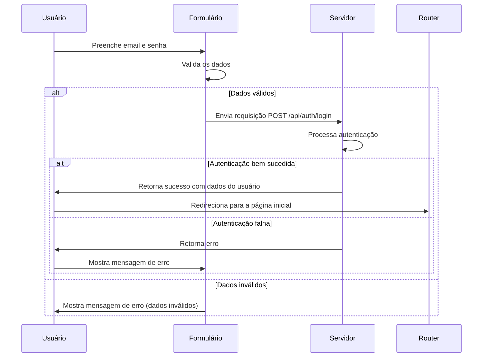

# Página de login

## Descrição geral

A página de login é a porta de entrada para o sistema INBCM, permitindo que usuários autenticados acessem suas funcionalidades restritas. Este documento detalha os componentes, a lógica e o fluxo de interação envolvidos na autenticação dos usuários.

## Tecnologias e bibliotecas utilizadas

- **React**: Framework JavaScript para construção de interfaces de usuário.
- **Zod**: Biblioteca para validação de esquemas, utilizada para validar os dados de entrada do usuário.
- **React Hook Form**: Biblioteca que facilita o gerenciamento de formulários em aplicações React, utilizando aqui o resolver do Zod para integração da validação.
- **@tanstack/react-query**: Biblioteca utilizada para gerenciar as operações assíncronas e o estado do servidor, incluindo a mutação de login.
- **React Router**: Utilizado para navegação após o sucesso do login.
- **CSS Tailwind**: Framework CSS para estilização dos componentes da página de forma responsiva.

## Estrutura da página

A página de login consiste em um formulário centrado que coleta o email e senha do usuário. O layout é responsivo, com uma ênfase visual no formulário em dispositivos menores e um painel decorativo adicional em dispositivos maiores.

### Componentes

#### Formulário de Login:

```jsx
<form onSubmit={handleSubmit(onSubmit)}>
  <Input
    type="email"
    label="Email"
    placeholder="Digite seu email"
    error={errors.email}
    {...register("email")}
  />
  <Input
    type="password"
    label="Senha"
    placeholder="Digite sua senha"
    error={errors.password}
    {...register("password")}
  />
  <button type="submit" disabled={isSubmitting}>
    Entrar
  </button>
</form>
```
- Campo de email e senha.
- Botão para submissão do formulário.
- Mensagens de erro dinâmicas que informam o usuário sobre problemas durante o processo de login.

#### Validação:

```javascript
const schema = z.object({
  email: z.string().min(1, "Este campo é obrigatório"),
  password: z.string().min(1, "Este campo é obrigatório")
});
```

Utiliza a biblioteca Zod para garantir que os campos de email e senha sejam preenchidos antes da submissão.

#### Processamento de login:

```javascript
const { mutate } = useMutation(loginUser);
const onSubmit = (data) => mutate(data);
```

- A submissão do formulário dispara uma mutação que faz uma requisição POST ao endpoint /api/auth/login.
- Em caso de sucesso, o usuário é redirecionado para a página inicial.
- Em caso de erro, uma mensagem de erro é exibida.
Fluxo do Usuário
- O usuário entra na página e preenche os campos de email e senha.
- Ao submeter, o formulário verifica a validade dos dados.
- Se os dados são válidos, uma requisição é enviada ao servidor.
- Dependendo da resposta do servidor, o usuário pode ser redirecionado para a página inicial ou informado de um erro.

## Diagrama de sequência



## Imagem da página


## Código fonte

O código fonte da página de login está bem organizado e modularizado, facilitando futuras manutenções e atualizações. Comentários explicativos são utilizados para clarificar a funcionalidade de blocos de código específicos.