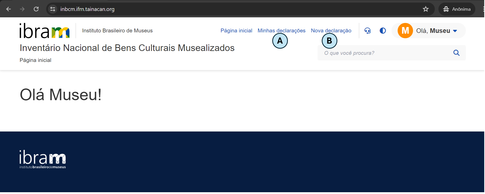
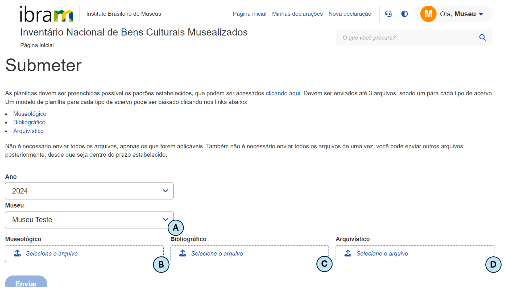

# Manual do usuário

## Introdução
Bem-vindo ao manual de usuário do módulo **Envio de Declarações**. O documento foi elaborado para fornecer uma orientação de como você pode utilizar as funcionalidades desta ferramenta.

Esse módulo foi desenvolvido para permitir que museus informem ao [Instituto Brasileiro de Museus (IBRAM)](https://www.gov.br/museus/pt-br) os bens que compõem os seus acervos. Por meio de uma interface intuitiva, o módulo visa simplificar o processo para declaração dos bens musealizados.

Para facilitar o seu entendimento, o manual foi dividido em seções. Na seção "Ambiente", você encontrará informações sobre os requisitos técnicos e as configurações para o funcionamento do módulo.

A seção "Como iniciar?" explica como você pode realizar o login e ter o seu primeiro acesso. Por fim, em "Funcionalidades", são detalhados  os principais recursos disponíveis, incluindo instruções para as operações mais comuns.

## Ambiente
O módulo de Envio de Declarações foi desenvolvido para ser executado em ambiente web, garantindo que ele esteja acessível em todas as regiões do país. A seguir, estão descritos os requisitos necessários para o funcionamento adequado do sistema:

1. **Conexão com a internet**: para acessar o módulo, é imprescindível possuir uma conexão estável com Internet. Uma conexão de banda larga é recomendada para assegurar confiabilidade no bom desempenho do sistema;
2. **Dispositivo**: o sistema pode ser acessado a partir de computadores _desktop_, _laptops_, _tablets_ ou _smartphones_. Certifique-se de que seu dispositivo esteja em boas condições de funcionamento;
3. **Configurações mínimas**: 4 GB de memória RAM (ou superior) e, pelo menos, 500 MB disponíveis;
4. **Navegadores compatíveis**: o módulo é compatível com os navegadores web mais populares. Portanto, recomenda-se a versão mais recente do Google Chrome ou do Mozilla Firefox ou do Safari.

## Objetivos
Este material tem como objetivo fornecer instruções detalhadas sobre a operacionalização do módulo Envio de Declarações, desenvolvido pelo [NOCS Lab](https://nocs.ifrn.edu.br/), uma laboratório _maker_ localizado no [IFRN/Parnamirim](https://portal.ifrn.edu.br/campus/parnamirim/). Os objetivos específicos deste documento incluem:

1. Oferecer instruções claras para que os usuários possam operar o módulo da melhor forma;
2. Garantir que os usuários utilizem as funcionalidades de forma intuitiva a fim de minimizar a curva de aprendizado; e
3. Explicar as funcionalidades atuais do módulo, por meio de capturas de tela, para assegurar uma compreensão ideal.

## Como iniciar?

Para acessar o módulo, siga os passos abaixo:

1. **Acessar o endereço eletrônico**: abra seu navegador web favorito e visite o endereço eletrônico <https://homologacao.inbcm.ifrn.tainacan.org>;
2. **Página de login**: na primeira página do portal, você verá a interface de login, conforme ilustrado na imagem abaixo:

Após preencher os campos "E-mail" e "Senha", pressione o botão "Entrar". Se suas credenciais tiverem sido informadas corretamente, você será redirecionado para a página principal da aplicação, como representado na imagem a seguir. 

Nesta página, estão disponíveis as seguintes funcionalidades:

1. **Minhas declarações** (indicada pela letra "A"): permite que o usuário visualize as declarações enviadas; e 
2. **Nova declaração** (indicada pela letra "B"): permite o envio de uma nova declaração ou de uma declaração retificadora.

## Funcionalidades
Nesta seção, são apresentadas as principais funcionalidades do módulo Envio de Declarações. As funcionalidades estão divididas em duas subseções: Minhas Declarações e Nova Declaração.

### Minhas declarações
Nesta página, o usuário pode visualizar as declarações que já foram enviadas. A funcionalidade permite ao usuário

1. acessar o histórico de declarações;
2. filtrar as declarações por diferentes critérios; e
3. detalhar os itens de cada declaração enviada.

Para cada declaração enviada, são exibidas informações como 

1. data de envio; 
2. ano da declaração;
3. nome do museu; 
4. situação em que se encontra a declaração; e
5. listagem das pendências.

Além disso, o usuário também pode fazer o download da(s) planilha(s) enviada(s) e do recibo de entrega da declaração. Nesta tela, como observado na imagem abaixo, também é possível que o usuário escolha, caso necessite, enviar uma declaração retificadora.
 

### Nova declaração 
Na página de envio de declarações, o usuário deve utilizá-la para enviar os bens que compõem o acervo do museu. De acordo com a [Resolução Normativa nº 6, de 31 de agosto de 2021](https://www.gov.br/museus/pt-br/assuntos/legislacao-e-normas/outros-instrumentos-normativo/resolucao-normativa-ibram-no-6-de-31-de-agosto-de-2021), os bens podem ser Museológico, Bibliográfico ou Arquivístico. Para cada um desses tipos, há um modelo de planilha no qual serão preenchidos os dados referentes aos bens. 

A página na qual o usuário pode enviar a sua declaração de bens é representada na imagem abaixo:

Caso o usuário seja responsável pelo envio da declaração de apenas um museu, automaticamente, o sistema entenderá que a(s) planilha(s) a ser(em) enviada(s) corresponde(m) àquele museu. No entanto, caso o usuário seja responsável por enviar a declaração de mais de um museu, deve ser especificado de qual museu está se enviando a declaração (o que é representado pela letra "A" da imagem).

Não é necessário que sejam enviadas planilhas para cada um dos tipos de bens, no entanto, pelo menos uma delas é obrigatória. Observa-se que, para cada tipo de bem, existe um campo correspondente (representado pelas letras "B", "C" e "D") em que o usuário pode informar a(s) planilha(s) a ser(em) enviada(s).