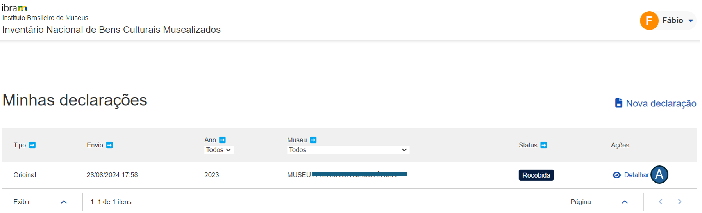
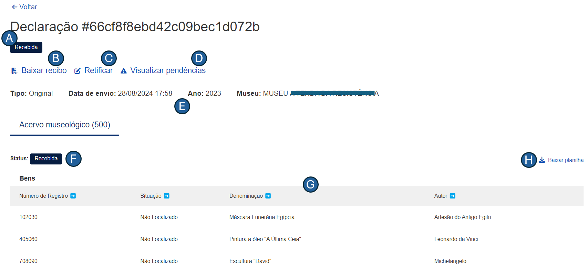

# Manual do usuário

## Introdução
Bem-vindo ao manual de usuário do módulo **Envio de Declarações**. O documento foi elaborado para fornecer uma orientação de como você pode utilizar as funcionalidades da ferramenta.

Esse módulo foi desenvolvido para permitir que museus informem ao [Instituto Brasileiro de Museus (IBRAM)](https://www.gov.br/museus/pt-br) os bens que compõem os seus acervos. Por meio de uma interface intuitiva, o módulo visa simplificar o processo para envio de declaração dos bens musealizados.

Para facilitar o seu entendimento, o manual foi dividido em seções. Na seção "Ambiente", você encontrará informações sobre os requisitos técnicos e as configurações para o funcionamento do módulo. A seção "Como iniciar?" explica como você pode realizar o login e ter o seu primeiro acesso. Por fim, em "Funcionalidades", são detalhados  os principais recursos disponíveis, incluindo instruções para as operações mais comuns.

## Ambiente
O módulo de Envio de Declarações foi desenvolvido para ser executado em um ambiente web, garantindo que ele esteja acessível em todas as regiões do país. A seguir, estão descritos os requisitos necessários para o funcionamento adequado do sistema:

1. **Conexão com a internet**: para acessar o módulo, é imprescindível que você possua uma conexão estável com a Internet;
2. **Dispositivo**: a declaração pode ser enviada através de vários dispositivos tais como computadores _desktop_, _laptops_, _tablets_ ou _smartphones_. Certifique-se de que seu dispositivo esteja em boas condições de funcionamento e com o antivírus atualizado;
3. **Configurações mínimas**: 4 GB de memória RAM (ou superior) e, pelo menos, 500 MB disponíveis;
4. **Navegadores compatíveis**: o módulo é compatível com os navegadores web mais populares. Portanto, recomenda-se a versão mais recente do Google Chrome ou do Mozilla Firefox ou do Safari.

## Objetivos
Este material tem como objetivo fornecer instruções detalhadas sobre a operacionalização do módulo Envio de Declarações, desenvolvido pelo [NOCS Lab](https://nocs.ifrn.edu.br/), uma laboratório _maker_ localizado no [IFRN/Parnamirim](https://portal.ifrn.edu.br/campus/parnamirim/). Os objetivos específicos deste documento incluem:

1. Oferecer instruções claras para que os usuários possam operar o módulo da melhor forma;
2. Garantir que os usuários utilizem as funcionalidades de forma intuitiva a fim de minimizar a curva de aprendizado; e
3. Explicar as funcionalidades atuais do módulo, por meio de capturas de tela, para assegurar uma compreensão ideal.

## Como iniciar?

Para acessar o módulo, siga os passos abaixo:

1. Acessar o endereço eletrônico: abra seu navegador web favorito e visite o endereço eletrônico <https://homologacao.inbcm.ifrn.tainacan.org>;
2. Página de login: na primeira página do portal, você verá a tela de login, conforme ilustrado na Figura 1.

**Figura 1** - Acesso ao módulo de Envio de Declarações.

Após preencher os campos **_E-mail_** e **_Senha_**, pressione o botão **_Entrar_**. Se suas credenciais tiverem sido informadas corretamente, sua sessão será redirecionada para a página inicial da aplicação, como apresentado na Figura 2.

## Funcionalidades
Nesta seção, são apresentadas as principais funcionalidades do módulo Envio de Declarações. Elas estão divididas em duas subseções: Enviar declaração e Visualizar declarações enviadas.

### ENVIAR NOVA DECLARAÇÃO
De acordo com a [Resolução Normativa nº 6, de 31 de agosto de 2021](https://www.gov.br/museus/pt-br/assuntos/legislacao-e-normas/outros-instrumentos-normativo/resolucao-normativa-ibram-no-6-de-31-de-agosto-de-2021), os bens podem ser de 03 (três) tipos:

+ Museológico: objetos preservados pelos museus devido ao seu valor histórico, artístico, científico ou cultural. Eles podem incluir artefatos, obras de arte, documentos históricos, etc.
+ Bibliográfico: pertence às coleções de bibliotecas incluindo livros, periódicos, manuscritos e outros materiais impressos ou digitais que são conservados por seu conteúdo informativo e cultural.
+ Arquivístico: documentos ou informações acumulados, resultantes de atividades governamentais, institucionais, corporativas ou pessoais, que são preservados devido ao seu valor permanente.

Para enviar uma nova declaração de bens, basta clicar no botão **_Nova declaração_** representado pela letra "A" da Figura 2.

**Figura 2** - Listagem de declarações enviadas.

Na sequência, a sessão será redirecionada para a página representada pela Figura 3. Para cada um dos tipos de bem, há um modelo de planilha na qual serão preenchidos os dados referentes. Caso você não possua os modelos das planilhas para preenchimento de sua declaração, é possível fazer o _download_ dos arquivos clicando em um dos _hiperlinks_, representados pela letra "A" da Figura 3.

**Figura 3** - Página para envio de novas declarações.

> É importante destacar que o acervo deve ser preenchido, rigorosamente, de acordo com os modelos fornecidos pelo IBRAM. Caso contrário, o arquivo do museu que contém o acervo não será enviado.

Na lista suspensa que é representada pela letra "C", informe de qual museu é a declaração a ser enviada. Já na lista suspensa (representada pela letra "D"), você deve escolher qual tipo de acervo deseja enviar. É possível selecionar um tipo ou mais de um.

Você perceberá que, de acordo com o tipo selecionado, será exibido um campo no qual você deve selecionar a planilha correspondente. Na tela apresentada, foi escolhido apenas o tipo de bem museológico, conforme letra "E". Não é necessário que seja enviada uma planilha para cada um dos 03 (três) tipos de bem. No entanto, pelo menos uma delas é obrigatória.

Ainda na Figura 3, foi exibida a seguinte mensagem de alerta: 

No exemplo da tela, a mensagem ocorre porque há linha(s) no arquivo em que, pelo menos, um campo obrigatório não foi informado. O sistema oferece uma opção para que você possa visualizar qual(is) campo(s) não foi(ram) preenchido(s). Ao clicar no _hiperlink_, representado pela letra "B", será exibida uma tela com as pendências. Veja a Figura 4.

**Figura 4** - Listagem de pendências encontradas no arquivo selecionado.

Após enviar uma nova declaração, a sessão será redirecionada para a página inicial "Minhas declarações" na qual serão exibidas as declarações enviadas. Observe a Figura 5. 

### VISUALIZAR DECLARAÇÕES ENVIADAS
A Figura 5, a seguir, apresenta as declarações que foram enviadas pelo museu. Nesta página, são oferecidas as seguintes funcionalidades: 

1. filtragem de declarações por ano e por museu;
2. ordenação por data de envio, ano, museu e status; e
3. detalhamento da declaração enviada.

**Figura 5** - Listagem de declarações enviadas.

Para cada declaração enviada, são exibidas informações como 

1. data de envio; 
2. ano da declaração;
3. nome do museu; e
4. situação em que se encontra a declaração.

Clicando no ícone **_Detalhar_**, como visto na figura abaixo, é possível visualizar o detalhamento da declaração:

Na tela de detalhamento da declaração, como se vê na imagem abaixo, é possível baixar o recibo da declaração enviada (representado pela letra "A"), enviar uma declaração retificadora (letra "B" da figura) e visualizar as pendências (representado pela letra "C"). Nessa tela, também é possível baixar o(s) arquivo(s) enviado(s), como se vê na letra "D" da figura:

Clicando no hiperlink "Visualizar pendências", o usuário consegue identificar quais são as pendências que há no(s) arquivo(s) enviado(s). No exemplo abaixo, percebe-se que há pendências nos três arquivos enviados.

