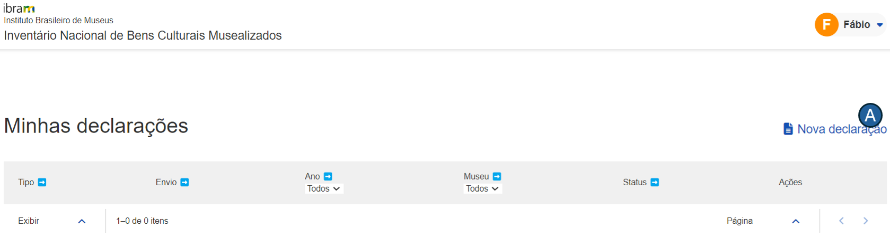

# Manual do usuário

## Introdução
Bem-vindo ao manual de usuário do módulo **Envio de Declarações**. O documento foi elaborado para fornecer uma orientação de como você pode utilizar as funcionalidades da ferramenta.

Esse módulo foi desenvolvido para permitir que museus informem ao [Instituto Brasileiro de Museus (IBRAM)](https://www.gov.br/museus/pt-br) os bens que compõem os seus acervos. Por meio de uma interface intuitiva, o módulo visa simplificar o processo para envio de declaração dos bens musealizados.

Para facilitar o seu entendimento, o manual foi dividido em seções. Na seção "Ambiente", você encontrará informações sobre os requisitos técnicos e as configurações para o funcionamento do módulo. A seção "Como iniciar?" explica como você pode realizar o login e ter o seu primeiro acesso. Por fim, em "Funcionalidades", são detalhados  os principais recursos disponíveis, incluindo instruções para as operações mais comuns.

## Ambiente
O módulo de Envio de Declarações foi desenvolvido para ser executado em um ambiente web, garantindo que ele esteja acessível em todas as regiões do país. A seguir, estão descritos os requisitos necessários para o funcionamento adequado do sistema:

1. **Conexão com a internet**: para acessar o módulo, é imprescindível que você possua uma conexão estável com a Internet;
2. **Dispositivo**: a declaração pode ser enviada através de vários dispositivos tais como computadores _desktop_, _laptops_, _tablets_ ou _smartphones_. Certifique-se de que seu dispositivo esteja em boas condições de funcionamento e com o antivírus atualizado;
3. **Configurações mínimas**: 4 GB de memória RAM (ou superior) e, pelo menos, 500 MB disponíveis;
4. **Navegadores compatíveis**: o módulo é compatível com os navegadores web mais populares. Portanto, recomenda-se a versão mais recente do Google Chrome ou do Mozilla Firefox ou do Safari.

## Objetivos
Este material tem como objetivo fornecer instruções detalhadas sobre a operacionalização do módulo Envio de Declarações, desenvolvido pelo [NOCS Lab](https://nocs.ifrn.edu.br/), uma laboratório _maker_ localizado no [IFRN/Parnamirim](https://portal.ifrn.edu.br/campus/parnamirim/). Os objetivos específicos deste documento incluem:

1. Oferecer instruções claras para que os usuários possam operar o módulo da melhor forma;
2. Garantir que os usuários utilizem as funcionalidades de forma intuitiva a fim de minimizar a curva de aprendizado; e
3. Explicar as funcionalidades atuais do módulo, por meio de capturas de tela, para assegurar uma compreensão ideal.

## Como iniciar?

Para acessar o módulo, siga os passos abaixo:

1. **Acessar o endereço eletrônico**: abra seu navegador web favorito e visite o endereço eletrônico <https://homologacao.inbcm.ifrn.tainacan.org>;
2. **Página de login**: na primeira página do portal, você verá a interface de login, conforme ilustrado na imagem abaixo:

Após preencher os campos "E-mail" e "Senha", pressione o botão "Entrar". Se suas credenciais tiverem sido informadas corretamente, você será redirecionado para a página principal da aplicação, como representado na imagem a seguir. 

Nesta página, estão disponíveis as seguintes funcionalidades:

1. **Nova declaração** (indicada pela letra "A"): permite o envio de uma nova declaração ou de uma declaração retificadora; e
2. **Minhas declarações** (indicada pela letra "B"): permite que o usuário visualize as declarações enviadas. 

## Funcionalidades
Nesta seção, são apresentadas as principais funcionalidades do módulo Envio de Declarações. Elas estão divididas em duas subseções: Enviar declaração e Visualizar declarações enviadas.

### Enviar declaração 
De acordo com a [Resolução Normativa nº 6, de 31 de agosto de 2021](https://www.gov.br/museus/pt-br/assuntos/legislacao-e-normas/outros-instrumentos-normativo/resolucao-normativa-ibram-no-6-de-31-de-agosto-de-2021), os bens podem ser Museológico, Bibliográfico ou Arquivístico. Para cada um desses tipos, há um modelo de planilha na qual serão preenchidos os dados referentes aos bens. 

Caso o usuário não possua os modelos das planilhas para preenchimento da declaração, é possível baixá-los clicando nos hiperlinks, representados pela letra "A" da figura abaixo. É importante destacar que o acervo deve ser preenchido, rigorosamente, conforme os modelos fornecidos. Caso contrário, o(s) arquivo(s) do acervo não será(ão) aceito(s).

Na lista suspensa, representada pela letra "C", o usuário deve informar de qual museu é a declaração correspondente. Não é necessário que seja enviada uma planilha para cada tipo de bem, no entanto, pelo menos uma delas é obrigatória. Há um campo para cada um dos tipos de bem (representados pelas letras "D", "E" e "F") em que o usuário deve informar a planilha a ser enviada.

Na imagem, percebe-se que foi exibida a seguinte mensagem de alerta: "Encontramos inconsistências no(s) arquivo(s) enviado(s). Você pode corrigi-las antes de enviar ou, se preferir 1) cancele o envio; 2) preencha os campos corretamente e; 3) mais tarde, retorne para enviar sua declaração. Para visualizar as inconsistências, clique aqui."

A mensagem ocorre porque há linha(s) na planilha em que, pelo menos, um campo obrigatório não foi informado. O sistema oferece uma opção (ver letra "B"), para que o usuário visualize qual(is) coluna(s) da(s) planilha(s) não foi(ram) preenchida(s).

### Visualizar declarações
Nesta página, o módulo oferece funcionalidades como 

1. filtrar as declarações por ano e por museu; e
2. detalhar a declaração enviada.

Para cada declaração enviada, são exibidas informações como 

1. data de envio; 
2. ano da declaração;
3. nome do museu; e
4. situação em que se encontra a declaração.

Clicando no ícone que é representado pela letra "A", como visto na figura abaixo, é possível visualizar o detalhamento da declaração:

Na tela de detalhamento da declaração, como se vê na imagem abaixo, é possível baixar o recibo da declaração enviada (representado pela letra "A"), enviar uma declaração retificadora (letra "B" da figura) e visualizar as pendências (representado pela letra "C"). Nessa tela, também é possível baixar o(s) arquivo(s) enviado(s), como se vê na letra "D" da figura:

 

