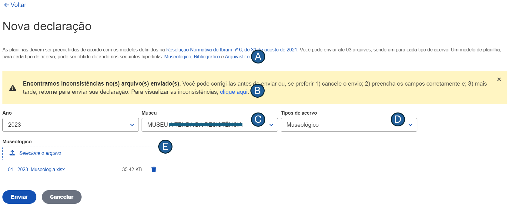

# Manual do usuário

## Introdução
Bem-vindo ao manual de usuário do módulo **Envio de Declarações**. O documento foi elaborado para fornecer uma orientação de como você pode utilizar as funcionalidades da ferramenta.

Esse módulo foi desenvolvido para permitir que museus informem ao [Instituto Brasileiro de Museus (IBRAM)](https://www.gov.br/museus/pt-br) os bens que compõem os seus acervos. Por meio de uma interface intuitiva, o módulo visa simplificar o processo para envio de declaração dos bens musealizados.

Para facilitar o seu entendimento, o manual foi dividido em seções. Na seção "Ambiente", você encontrará informações sobre os requisitos técnicos e as configurações para o funcionamento do módulo. A seção "Como iniciar?" explica como você pode realizar o login e ter o seu primeiro acesso. Por fim, em "Funcionalidades", são detalhados  os principais recursos disponíveis, incluindo instruções para as operações mais comuns.

## Ambiente
O módulo de Envio de Declarações foi desenvolvido para ser executado em um ambiente web, garantindo que ele esteja acessível em todas as regiões do país. A seguir, estão descritos os requisitos necessários para o funcionamento adequado do sistema:

1. **Conexão com a internet**: para acessar o módulo, é imprescindível que você possua uma conexão estável com a Internet;
2. **Dispositivo**: a declaração pode ser enviada através de vários dispositivos tais como computadores _desktop_, _laptops_, _tablets_ ou _smartphones_. Certifique-se de que seu dispositivo esteja em boas condições de funcionamento e com o antivírus atualizado;
3. **Configurações mínimas**: 4 GB de memória RAM (ou superior) e, pelo menos, 500 MB disponíveis;
4. **Navegadores compatíveis**: o módulo é compatível com os navegadores web mais populares. Portanto, recomenda-se a versão mais recente do Google Chrome ou do Mozilla Firefox ou do Safari.

## Objetivos
Este material tem como objetivo fornecer instruções detalhadas sobre a operacionalização do módulo Envio de Declarações, desenvolvido pelo [NOCS Lab](https://nocs.ifrn.edu.br/), uma laboratório _maker_ localizado no [IFRN/Parnamirim](https://portal.ifrn.edu.br/campus/parnamirim/). Os objetivos específicos deste documento incluem:

1. Oferecer instruções claras para que os usuários possam operar o módulo da melhor forma;
2. Garantir que os usuários utilizem as funcionalidades de forma intuitiva a fim de minimizar a curva de aprendizado; e
3. Explicar as funcionalidades atuais do módulo, por meio de capturas de tela, para assegurar uma compreensão ideal.

## Como iniciar?

Para acessar o módulo, siga os passos abaixo:

1. **Acessar o endereço eletrônico**: abra seu navegador web favorito e visite o endereço eletrônico <https://homologacao.inbcm.ifrn.tainacan.org>;
2. **Página de login**: na primeira página do portal, você verá a tela de login, conforme ilustrado na Figura 1.

**Figura 1** - Acesso ao módulo de Envio de Declarações.

Após preencher os campos **_E-mail_** e **_Senha_**, pressione o botão **_Entrar_**. Se suas credenciais tiverem sido informadas corretamente, sua sessão será redirecionada para a página inicial da aplicação, como apresentado na Figura 2.

## Como enviar uma declaração?
Antes de apresentarmos quais são os passos para o envio de uma declaração, é importante ressaltar que, de acordo com a [Resolução Normativa IBRAM nº 6, de 31 de agosto de 2021](https://www.gov.br/museus/pt-br/assuntos/legislacao-e-normas/outros-instrumentos-normativo/resolucao-normativa-ibram-no-6-de-31-de-agosto-de-2021), os bens podem ser categorizados em 03 (três) tipos:

+ Museológico: objetos preservados pelos museus devido ao seu valor histórico, artístico, científico ou cultural. Eles podem incluir artefatos, obras de arte, documentos históricos, etc.
+ Bibliográfico: pertence às coleções de bibliotecas incluindo livros, periódicos, manuscritos e outros materiais impressos ou digitais que são conservados por seu conteúdo informativo e cultural.
+ Arquivístico: documentos ou informações acumulados, resultantes de atividades governamentais, institucionais, corporativas ou pessoais, que são preservados devido ao seu valor permanente.

Depois de comentados os tipos de bens de um museu, é possível apresentar os passos necessários para enviar uma declaração. Para isso, basta clicar no botão **_Nova declaração_** representado pela letra "A" da Figura 2.

**Figura 2** - Listagem de declarações enviadas.

Na sequência, o sistema é redirecionado para a página de envio de uma nova declaração, apresentado na Figura 3. Para cada um dos tipos de bem, há um modelo de planilha na qual devem ser preenchidos os dados referentes. Caso você não possua os modelos das planilhas para preenchimento de sua declaração, é possível fazer o _download_ dos arquivos clicando em um dos _hiperlinks_, representados pela letra "A" da Figura 3. As planilhas também podem ser baixadas aqui: [Museológico](https://homologacao.inbcm.ifrn.tainacan.org/INBCM_Museologia.xlsx), [Bibliográfico](https://homologacao.inbcm.ifrn.tainacan.org/INBCM_Biblioteconomia.xlsx) e [Arquivístico](https://homologacao.inbcm.ifrn.tainacan.org/INBCM_Arquivologia.xlsx).

**Figura 3** - Envio de novas declarações.

> É importante destacar que o acervo deve ser preenchido, rigorosamente, de acordo com os modelos fornecidos pelo IBRAM. Caso contrário, o arquivo do museu que contém o acervo não será enviado.

Na lista suspensa que é representada pela letra "C", deve-se informar de qual museu é a declaração a ser enviada. Já na lista suspensa (representada pela letra "D"), deve-se escolher qual tipo de acervo será enviado. É possível selecionar um ou mais tipos de acervo.

Percebe-se que, de acordo com o tipo selecionado, será exibido um campo no qual deve-se selecionar a planilha correspondente. Na tela apresentada, foi escolhido apenas o tipo de bem museológico, conforme letra "E". Não é necessário que seja enviada uma planilha para cada um dos 03 (três) tipos de acervo. No entanto, pelo menos uma planilha é obrigatória.

Ainda na Figura 3, foi exibida a seguinte mensagem de alerta: 

No exemplo apresentado, a mensagem ocorre porque há linha(s) no arquivo em que, pelo menos, um campo obrigatório não foi informado. O sistema oferece uma opção para que você possa visualizar qual(is) campo(s) não foi(ram) preenchido(s). Ao clicar no _hiperlink_, representado pela letra "B", será exibida uma tela com as pendências. Veja a Figura 4.

**Figura 4** - Listagem de pendências encontradas no arquivo selecionado.

Após pressionar o botão **_Enviar_**, o sistema será redirecionada para a página "Minhas declarações" na qual serão exibidas todas as declarações enviadas. 

## Como visualizar Minhas declarações?
A Figura 5 apresenta as declarações que foram enviadas pelo museu. Para cada declaração enviada, são exibidas as seguintes informações: 

1. tipo da declaração (Original ou Retificada)
2. data e hora do envio; 
2. ano da declaração;
3. nome do museu; e
4. situação em que se encontra a declaração.

**Figura 5** - Listagem de declarações enviadas.

As declarações podem ser exibidas de maneiras diferentes, a depender das opções que você escolher. São elas: 

1. filtragem por ano e/ou por museu;
2. ordenação por data/hora de envio;
3. ordenação por ano;
4. ordenação por nome do museu; e
5. ordenação por status.

Clicando no ícone **_Detalhar_**, representado pela letra "A" da Figura 5, é possível visualizar o detalhamento de uma declaração.

## Como detalhar Minhas declarações?
Na tela de detalhamento da declaração, como visto na Figura 6, é possível obter várias informações relacionadas a uma declaração, bem como realizar algumas operações:

1. informação sobre o status da declaração, indicado pela letra "A";
2. realizar _download_ do recibo de entrega, indicado pela letra "B";
3. efetuar a retificação da declaração anterior, indicado pela letra "C";
4. listar as pendências que foram identificadas na declaração enviada, indicado pela letra "D";
5. informações gerais da declaração tais como tipo, envio, ano e nome do museu (indicado pela letra "E");
6. informação do status da planilha enviada, indicado pela letra "F";
7. informações básicas do acervo enviado, indicado pela letra "G"; e
8. realizar _download_ da planilha enviada, indicado pela letra "H".

**Figura 6** - Detalhamento da declaração.

## Como retificar uma declaração?
A declaração retificadora consiste em uma nova versão que substitui uma declaração já enviada de um determinado ano. Quando uma retificadora é enviada, ela substitui a última declaração submetida. Por exemplo, a primeira retificadora enviada substitui a declaração original e, se necessária outra correção, a nova retificadora substituirá a enviada anteriormente.

Para facilitar o entendimento, imagine que uma declaração foi inicialmente enviada com o tipo de acervo museológico. Posteriormente, se essa declaração for retificada para incluir um acervo bibliográfico, será necessário informar apenas o novo tipo de acervo, ou seja, o bibliográfico. Veja a Figura 7.

**Figura 7** - Envio de declarações retificadoras.

Ao submeter a nova declaração, ela passa a ser do tipo retificadora, conforme Figura 8. Observe que a quantidade de itens do acervo museológico permanece o mesmo (500 itens, veja a letra "A") e o tipo bibliográfico foi incluído à declaração, contendo 7 (sete) itens de acordo com a letra "B" da figura.

**Figura 8** - Declaração após retificação.

## Download do recibo de comprovante de envio
O módulo Envio de Declaração permite o _download_ do recibo de comprovante de envio. Ele permite obter um registro formal da submissão de suas declarações. Este recibo é gerado, automaticamente em formato PDF, após a conclusão do envio de uma declaração. Ele contém informações essenciais como o número da declaração, a data e hora de envio, bem como a quantidade de itens agrupados por tipo de acervo.

O recibo serve como uma garantia confirmando que sua declaração foi devidamente registrada no sistema. Além disso, ele pode ser utilizado para fins de arquivo pessoal ou para apresentar como comprovante em eventuais auditorias. A funcionalidade de _download_ é intuitiva e pode ser acessada facilmente no módulo Envio de Declaração. Observe a estrutura do recibo por meio da Figura 9.

**Figura 9** - Recibo de comprovante de envio da declaração.

