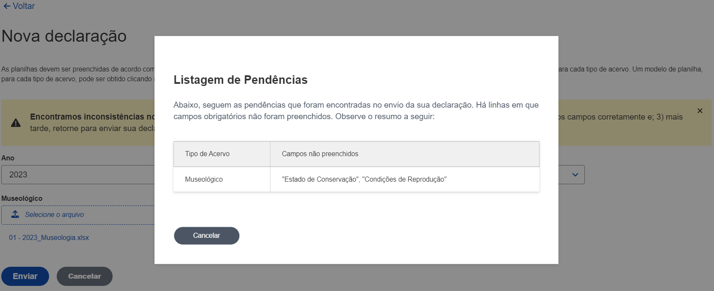

# Página principal - Minhas declarações

## Descrição geral

Após o login, os usuários são direcionados para a página principal, que exibe uma lista de declarações associadas ao usuário. Esta página permite aos usuários visualizar, filtrar e acessar detalhes específicos das declarações, bem como adicionar novas declarações.

## Tecnologias e bibliotecas utilizadas

- **React**: Usado para construir a interface do usuário.
- **React Query**: Gerencia e sincroniza o estado do servidor, usando `useSuspenseQuery` para carregar dados de maneira assíncrona.
- **React Table**: Utilizado para criar e manipular tabelas dinamicamente com suporte a filtros.
- **Date-Fns**: Usado para formatar datas.
- **React Router Dom**: Facilita a navegação entre as páginas.

## Estrutura da página

A página inclui um layout padrão `DefaultLayout`, que provavelmente contém elementos comuns como cabeçalho, rodapé, e navegação lateral.

### Componentes

#### Cabeçalho e botão de ação

- Título da página ("Minhas declarações").
- Botão para adicionar uma nova declaração.

#### Tabela de declarações

- Mostra várias colunas como "Data de envio", "Ano", "Museu", e "Status".
- Cada declaração possui ações como "Detalhar", permitindo ao usuário ver mais detalhes.

## Fluxo de dados


## Exemplos de código

### Carregamento de dados

```typescript
const { data } = useSuspenseQuery({
  queryKey: ["declaracoes"],
  queryFn: async () => {
    const response = await request("/api/declaracoes");
    return response.json();
  }
});
```

### Estrutura da tabela
```typescript
const columns = [
  columnHelper.accessor("dataCriacao", {
    header: "Data de envio",
    cell: info => format(info.getValue(), "dd/MM/yyyy HH:mm")
  }),
  columnHelper.accessor("anoDeclaracao", {
    header: "Ano"
  }),
  columnHelper.accessor("museu_id.nome", {
    header: "Museu"
  }),
  columnHelper.accessor("status", {
    header: "Status"
  }),
  // Exemplo de coluna de ações
  columnHelper.accessor("_id", {
    header: "Ações",
    cell: info => (
      <Link to={`/declaracoes/${info.getValue()}`}>Detalhar</Link>
    )
  })
];
```

## Imagem da página



## Considerações finais

Esta documentação fornece uma visão geral da página principal após o login, destacando os componentes chave e o fluxo de dados.