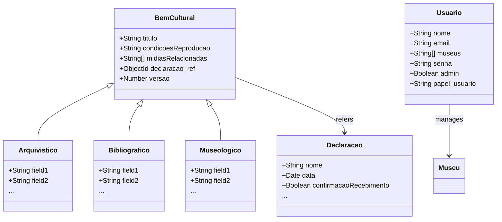

# Documentação dos Modelos de Dados

## Modelos de dados

### Estrutura dos modelos (Schemas)

#### Arquivístico
```typescript
import mongoose from "mongoose";
import Bem from "./BemCultural";
import { arquivistico } from "inbcm-xlsx-validator/schema";

const fields: Record<string, unknown> = {}

for (const field of Object.keys(arquivistico.fields)) {
  fields[field] = { type: String }
}

// Modelo específico para documentos arquivísticos
const ArquivisticoSchema = new mongoose.Schema(fields);

// Use discriminadores para distinguir os modelos
export const Arquivistico = Bem.discriminator(
  "Arquivistico",
  ArquivisticoSchema
);
```

O modelo **Arquivístico** é um sub-tipo de `BemCultural`, utilizando um discriminador para diferenciar documentos arquivísticos.

#### Bem Cultural
```typescript
import mongoose, { Schema } from "mongoose";

const BemCulturalSchema = new mongoose.Schema(
  {
    titulo: { type: String },
    condicoesReproducao: { type: String, alias: "condicoesreproducao" },
    midiasRelacionadas: { type: [String], alias: "midiasrelacionadas" },
    declaracao_ref: {
      type: Schema.Types.ObjectId,
      required: true,
      ref: "Declaracoes"
    },
    versao: { type: Number, default: 0 }
  },
  { versionKey: false }
);

const BemCultural = mongoose.model("bens", BemCulturalSchema);

export default BemCultural;
```

O **Bem Cultural** inclui referências a declarações e pode ter várias mídias relacionadas. Este modelo é a base para outros modelos como **Arquivístico**, **Bibliográfico** e **Museológico**.

#### Bibliográfico
```typescript
import mongoose from "mongoose";
import Bem from "./BemCultural";
import { bibliografico } from "inbcm-xlsx-validator/schema";

const fields: Record<string, unknown> = {}

for (const field of Object.keys(bibliografico.fields)) {
  fields[field] = { type: String }
}

// Modelo específico para documentos bibliográficos
const BibliograficoSchema = new mongoose.Schema(fields);

// Use discriminadores para distinguir os modelos
export const Bibliografico = Bem.discriminator(
  "Bibliografico",
  BibliograficoSchema
);
```

O modelo **Bibliográfico** segue a mesma estrutura de discriminação como o **Arquivístico**, sendo um sub-tipo de `BemCultural`.

### Relacionamentos

Os relacionamentos entre os modelos são definidos principalmente através de referências (`ref`) no Mongoose. Aqui estão os principais relacionamentos:

- **Bem Cultural**: Referencia a `Declaracoes` através do campo `declaracao_ref`.
- **Usuário**: Pode estar associado a vários museus através do array `museus`.

### Validações

As validações nos modelos incluem:

- **Obrigatoriedade**: Campos como `titulo` em `BemCultural`, `nome` em `Usuario`, e `museu` em `Arquivistico` são obrigatórios.
- **Único**: O campo `email` em `Usuario` é único para garantir que não existam duplicatas.
- **Enumerações**: O campo `papel_usuario` em `Usuario` é limitado aos valores `"administrador"` e `"analista"`.

## Diagrama de classes

O diagrama de classes descrito abaixo tem como objetivo fornecer uma visão clara e estruturada da arquitetura das entidades do sistema. Ele detalha as principais entidades envolvidas e suas inter-relações, facilitando a compreensão dos mecanismos de dados e funcionalidades do sistema. Este diagrama é essencial tanto para novos desenvolvedores quanto para stakeholders, ajudando-os a visualizar a organização dos componentes e como eles interagem para suportar as operações do sistema.


